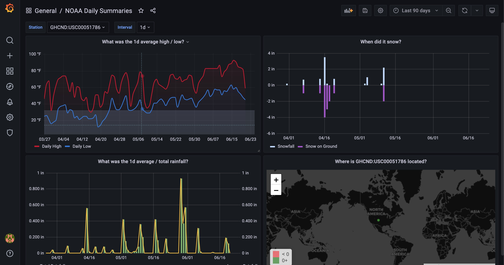

# NOAA-CDO-Weather-Data

Background Info: https://www.ncdc.noaa.gov/cdo-web/

Search for stations near you: https://www.ncdc.noaa.gov/cdo-web/search

API Docs: https://www.ncdc.noaa.gov/cdo-web/webservices/v2

## Prerequisites
1. Docker (https://docs.docker.com/get-docker/)
2. Docker Compose (https://docs.docker.com/compose/install/)

## Quickstart

1. Get a CDO token here: https://www.ncdc.noaa.gov/cdo-web/token
2. Edit the docker-compose.yaml and paste your token as the value for the NOAA_CDO_TOKEN envirnoment variable
3. Open a terminal and run `docker-compose up`
4. Open a web browser and navigate to http://localhost:3000
    1. Use admin/admin to log in
    2. Change your password when prompted
5. Use the link above to search for a station you want to get data from or use CITY:US000001 for Washington D.C.
6. Open another browser tab and navigate to http://localhost/docs
    1. Expand the POST for /stations
    2. Click Try it out
    3. Paste your station ID as the value for station_id in the payload
    4. Click execute, if the station id is valid you should see the station details in the response
    5. Expand the GET for /daily/{station_id}
    6. Paste your station ID in the textbox and click execute
    7. This could take a while the first time as it gets a year worth of data
    8. If it works correctly you'll see the raw data pulled back in the response
7. Go back to the Grafana tab and click the word Home at the top where it says Grafana / Home
8. Click NOAA Daily Summaries in the General folder
9. It should look something like this:
   
